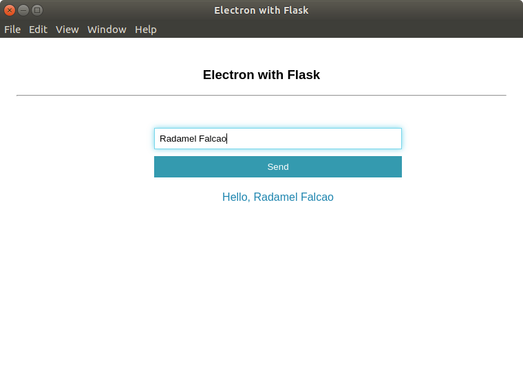

# Electron with Flask

## Installation 

```
make install
```

## Running in local

```
make run
```

## Build

```
make build
```

## Running packaged

```
make run-packaged
```

**NOTE**:  `electron-builder` hasn't finished yet. Check `electron/main.js/runFlask()`. It is currently manual, use `files` option of `electron-builder`  

## Demo


