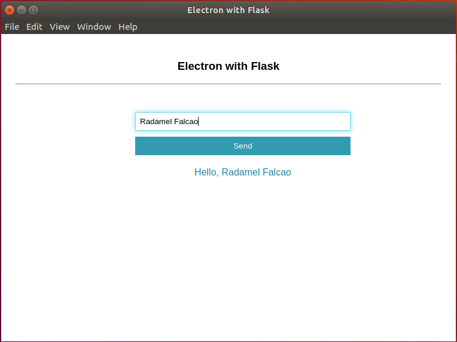

# Electron with Flask

Create a flask application at backend and use its rest services at frontend with electron. `flask` can be packaged as a standalone desktop application as well as `electron`. Here we can use packaged `flask` in `electron` as rest api service. 

1. **pyinstaller**: Backend, flask packaging
2. **electron-builder**: Frontend, electron packaging

> Please note that this repository is a demo for this case, it is not working completely.

## Installation 

```
make install
```

## Running in local

```
make run
```

## Build

```
make build
```

## Running packaged

```
make run-packaged
```

**NOTE**:  `electron-builder` hasn't finished yet. Check `electron/main.js/runFlask()`. It is currently manual, use `files` option of `electron-builder`. 

## Demo


